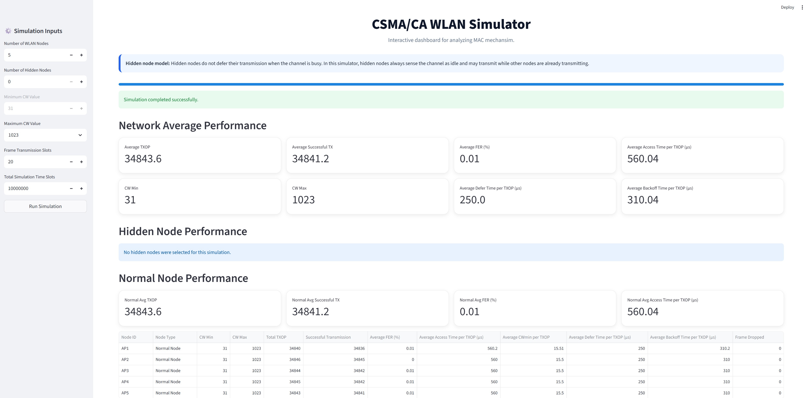

# CSMA/CA WLAN Simulator

Interactive Streamlit dashboard for simulating CSMA/CA WLAN hidden-node behavior, contention analysis, collision probability, and contention window dynamics.

---

# Project Overview

This project implements a Python-based CSMA/CA WLAN simulator. The simulator analyzes WLAN MAC-layer performance under different contention window configurations and hidden-node scenarios. The dashboard visualizes network statistics including TXOP, successful transmissions, frame error rate (FER), access delay, and CW frequency distribution.

The project aim to understand:

- MAC protocol analysis
- Hidden-node impact
- IEEE 802.11 contention analysis
  

# Dependencies

Install dependencies using:

```bash
pip install streamlit numpy pandas matplotlib
```

# How to run 

```bash
streamlit run csma_ca_performance_dashboard.py
```

If the dashboard does not open automatically, open:
http://localhost:8501

# Dashboard




---

# User Input Parameters

The simulator allows users to configure different WLAN contention and hidden-node scenarios using the Streamlit sidebar inputs.

## Number of WLAN Nodes

Defines the total number of contending WLAN nodes participating in channel access and contention.

Higher numbers increase:
- channel contention
- collision probability
- access delay

---

## Number of Hidden Nodes

Defines how many nodes behave as hidden nodes.

Hidden nodes:
- do not defer when the channel is busy
- always sense the channel as idle
- may transmit simultaneously with other nodes

This increases:
- collisions
- frame error rate (FER)
- unfair channel access

---

## Total Simulation Time Slots

Defines the total duration of the simulation in time slots.

Larger simulation times provide:
- more stable averages
- better statistical accuracy
- improved performance evaluation

---

## Frame Transmission Slots

Defines the transmission duration of a frame in time slots.

Currently:
- all nodes use the same frame transmission duration
- all transmitted frames have equal size

---

## Minimum Contention Window (CW Min)

Defines the minimum contention window size.

Currently:
- CW Min is fixed at 31

After successful transmission:
- the contention window resets to CW Min

---

## Maximum Contention Window (CW Max)

Defines the maximum contention window size.

Supported values:
- 63
- 127
- 255
- 511
- 1023

After collisions:
- the contention window increases exponentially
- CW size is limited by CW Max

---

# Current Assumptions

The current simulator assumes:

- Saturated network conditions
- Every node always has frames ready for transmission
- Equal frame transmission duration for all nodes
- Fixed transmission power
- Single shared wireless channel

---

# Future Improvements

Future versions of the simulator will include:

- Unsaturated traffic models
- Variable frame sizes
- Adaptive transmission power control
- Dynamic carrier sensing threshold adjustment
- Reinforcement learning based contention management
